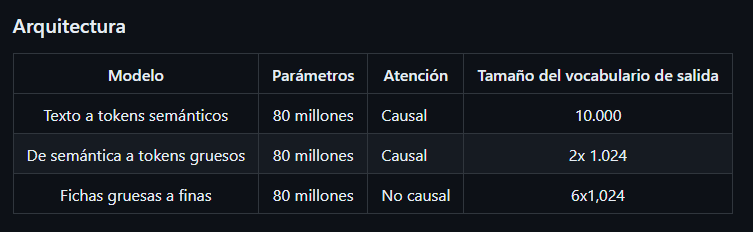

# AI_project_3_backend

Project 3 (Tutor) of AI

Create a folder named `static` with two folders inside one called `speakers` and one called `user_audios`
Install dependencies `pip install -r ./requirements.txt`
To run the server use `fastapi dev main.py`

# Modelos

## Suno ia (pasa de texto a voz)

Bark is a transformer-based text-to-audio model created by Suno. Bark can generate highly realistic, multilingual speech as well as other audio - including music, background noise and simple sound effects. The model can also produce nonverbal communications like laughing, sighing and crying. To support the research community, we are providing access to pretrained model checkpoints ready for inference.

### Arquitectura
Bark es una serie de tres modelos de transformadores que convierten texto en audio.

- Texto a tokens semánticos
- De semántica a tokens gruesos
- Fichas gruesas a finas

Detalle de su documentacion https://github.com/chenxwh/bark/blob/main/model-card.md

Link modelo en replicate: https://replicate.com/suno-ai/bark?prediction=5dhp9mcyvsrga0cgd8mbzsneew

## Fast whisper (Transcribe audio a texto) -> Seq2Seq

Whisper es un modelo de codificador-decodificador basado en Transformer, también conocido como modelo de secuencia a secuencia . Se entrenó con 1 millón de horas de audio débilmente etiquetado y 4 millones de horas de audio pseudoetiquetado recopilados con Whisper large-v2.

 

Detalle de su documentacion:
https://huggingface.co/openai/whisper-large-v3
https://github.com/openai/whisper

Link modelo en replicate: https://replicate.com/vaibhavs10/incredibly-fast-whisper

## Meta-llama-3-8b-instruct (genera la respuesta las preguntas que haga el usuario)

Llama 3 es un modelo de lenguaje autorregresivo que utiliza una arquitectura de transformador optimizada. Las versiones optimizadas utilizan un ajuste fino supervisado (SFT) y aprendizaje de refuerzo con retroalimentación humana (RLHF) para alinearse con las preferencias humanas de ayuda y seguridad.

 

Detalle de su documentación: https://github.com/meta-llama/llama3/blob/main/MODEL_CARD.md

Link modelo en replictae: https://replicate.com/meta/meta-llama-3-8b-instruct
