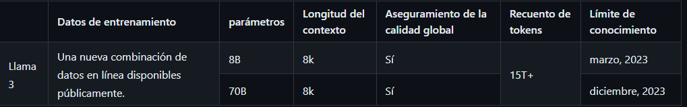

# AI_project_3_backend

Project 3 (Tutor) of AI

Create a folder named `static` with two folders inside one called `speakers` and one called `user_audios`
Install dependencies `pip install -r ./requirements.txt`
To run the server use `fastapi dev main.py`

# Modelos

## XTTS- v2 (Clonación de voz, pasa de texto a voz)

### Características 
- Clonación de voz.
- Clonación de voz entre idiomas.
- Generación de voz multilingüe.
- Frecuencia de muestreo de 24 kHz.
- Inferencia de transmisión con latencia <200 ms. 
- Clonación de voz mejorada.
- Las voces se pueden clonar con un solo archivo de audio o con varios archivos de audio, sin ningún efecto en el tiempo de ejecución.
- 2 nuevos idiomas: húngaro y coreano.

Detalle de su documentacion https://docs.coqui.ai/en/latest/models/xtts.html#features

Link modelo en replicate: https://replicate.com/lucataco/xtts-v2

## Fast whisper (Transcribe audio a texto) -> Seq2Seq

Whisper es un modelo de codificador-decodificador basado en Transformer, también conocido como modelo de secuencia a secuencia . Se entrenó con 1 millón de horas de audio débilmente etiquetado y 4 millones de horas de audio pseudoetiquetado recopilados con Whisper large-v2.

 

Detalle de su documentacion:
https://huggingface.co/openai/whisper-large-v3
https://github.com/openai/whisper

Link modelo en replicate: https://replicate.com/vaibhavs10/incredibly-fast-whisper

## Meta-llama-3-8b-instruct (genera la respuesta las preguntas que haga el usuario)

Llama 3 es un modelo de lenguaje autorregresivo que utiliza una arquitectura de transformador optimizada. Las versiones optimizadas utilizan un ajuste fino supervisado (SFT) y aprendizaje de refuerzo con retroalimentación humana (RLHF) para alinearse con las preferencias humanas de ayuda y seguridad.

 

Detalle de su documentación: https://github.com/meta-llama/llama3/blob/main/MODEL_CARD.md

Link modelo en replictae: https://replicate.com/meta/meta-llama-3-8b-instruct
